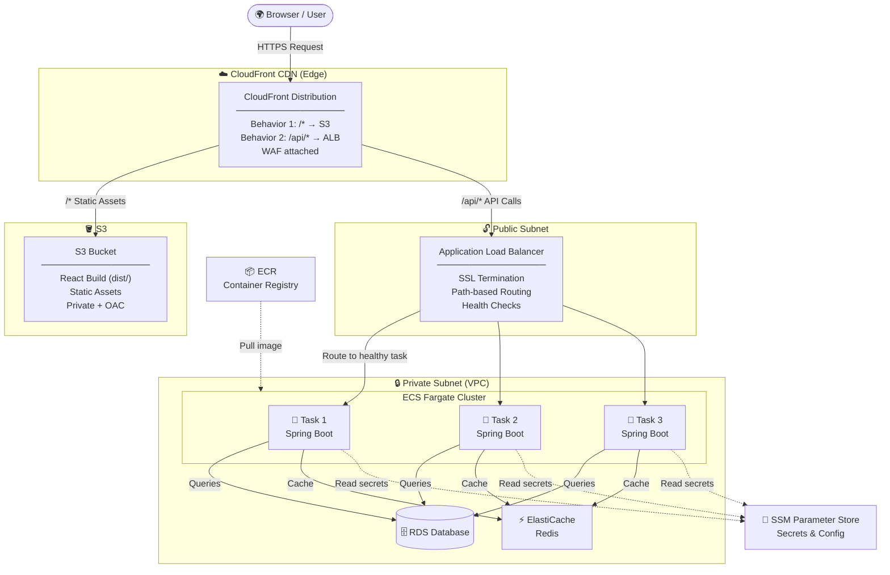
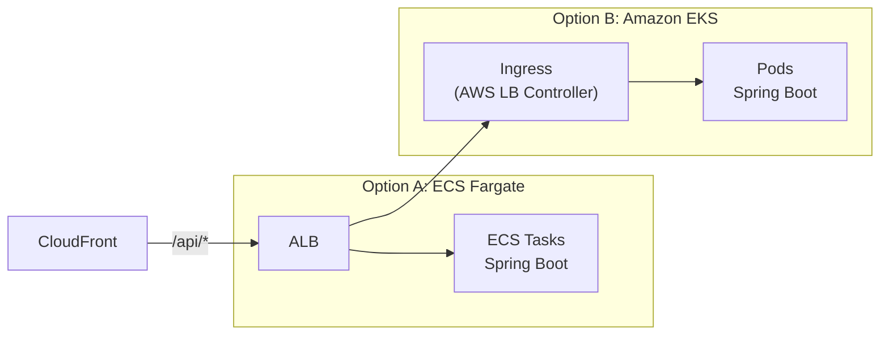

# System Design: How a React Frontend Communicates with a Spring Boot Backend on AWS

> A practical guide to building a scalable, secure, and extensible web application architecture using AWS CloudFront, S3, ECS Fargate, and an Application Load Balancer.

---

## Table of Contents

- [Introduction](#introduction)
- [Architecture Overview](#architecture-overview)
- [System Design Diagram](#system-design-diagram)
- [Request Flow](#request-flow)
  - [Static Asset Flow](#1-static-asset-flow--loading-the-react-app)
  - [API Call Flow](#2-api-call-flow--react-to-spring-boot)
- [Extensibility: Migrating to Amazon EKS](#extensibility-migrating-to-amazon-eks)
- [Horizontal Scalability](#horizontal-scalability)
- [Security Architecture](#security-architecture)
- [Summary](#summary)

---

## Introduction

Modern web applications demand a clear separation of concerns between the frontend and backend — and cloud infrastructure should support that naturally.

In this post, we walk through a production-grade AWS architecture where a **React frontend** is served via a CDN and a **Spring Boot backend** runs on containerised infrastructure. We also explore how the design remains **extensible** (swap ECS for EKS with zero frontend changes), **horizontally scalable** (every layer scales independently), and **secure** (defence in depth throughout).

> 💡 **Key principle:** All three layers — CDN, static hosting, and compute — are decoupled. Each can scale, change, or fail independently without affecting the others.

---

## Architecture Overview

The architecture has four logical layers, each with a distinct responsibility.

### 1. Content Delivery — CloudFront

AWS CloudFront acts as the **single entry point** for all traffic — both static asset requests and API calls. It sits at the edge, close to the user, and uses **behaviour rules** to route traffic to the correct origin. This single-domain approach eliminates CORS complexity entirely.

### 2. Static Hosting — S3

The React application is built using `npm run build` and the output `dist/` folder is uploaded to an S3 bucket. The bucket is **private** — only CloudFront can read from it via Origin Access Control (OAC). No public S3 access is required.

### 3. API Routing — Application Load Balancer (ALB)

The Application Load Balancer lives in a public subnet but is shielded from direct internet access. CloudFront forwards `/api/*` requests to the ALB, which distributes them across healthy ECS tasks using round-robin or least-connections routing.

### 4. Compute — ECS Fargate

Spring Boot runs as Docker containers inside an ECS Fargate cluster in a **private subnet**. Fargate is serverless containers — AWS manages the underlying infrastructure, so you only think about tasks and services. Tasks connect to RDS for persistence and ElastiCache (Redis) for caching.

| Layer | AWS Service | Responsibility |
|---|---|---|
| CDN / Entry Point | CloudFront | Route traffic, cache static assets, attach WAF |
| Static Hosting | S3 | Store and serve React build artifacts |
| Load Balancing | ALB | Distribute API traffic, SSL termination |
| Compute | ECS Fargate | Run Spring Boot containers |
| Database | RDS | Managed relational database |
| Caching | ElastiCache (Redis) | Reduce DB load, speed up reads |
| Secrets | SSM Parameter Store | Encrypted config and credentials |

---

## System Design Diagram



---

## Request Flow

### 1. Static Asset Flow — Loading the React App

When a user first visits the application, the browser needs to download the React application itself.

1. User visits `yourdomain.com` in the browser
2. DNS resolves to CloudFront's edge network
3. CloudFront matches the **default `/*` behaviour** → origin is the S3 bucket
4. If the asset is cached at the edge: served instantly with minimal latency
5. If not cached: CloudFront fetches from S3 using OAC (signed request)
6. Browser receives `index.html` + JS/CSS bundles — React app boots in the browser

### 2. API Call Flow — React to Spring Boot

Once the React app is running, every API call follows this path:

1. React calls `fetch('/api/users')` — a **relative URL**, no hardcoded backend address
2. Request goes to CloudFront (same domain as the React app — no CORS)
3. CloudFront matches the **`/api/*` behaviour** → forwards to the ALB origin
4. CloudFront attaches a **secret custom header** to authenticate the request
5. ALB receives the request, validates the header, selects a healthy ECS task
6. Spring Boot container processes the request, queries RDS or Redis as needed
7. JSON response travels back: **ECS → ALB → CloudFront → Browser**

```
Browser
  │
  ├──  GET /               → CloudFront → S3        → React App (HTML/JS/CSS)
  │
  └──  GET /api/users      → CloudFront → ALB → ECS  → JSON Response
```

> ✅ **Important:** Because React uses relative paths like `/api/users` instead of `https://api.myapp.com/users`, the frontend build artifact is **environment-agnostic**. The same `dist/` folder works in dev, QA, and production — only the CloudFront behaviour target changes per environment.

---

## Extensibility: Migrating to Amazon EKS

One of the most important properties of this architecture is that the **frontend is completely decoupled from the backend compute layer**. CloudFront only knows about the ALB — it does not know or care whether ECS Fargate, EKS, or bare EC2 instances sit behind it.

This means migrating from ECS Fargate to Amazon EKS (Kubernetes) requires **zero changes to the frontend, S3, or CloudFront**. Only the backend compute layer is swapped.

### What Changes (Backend Only)

| ECS Fargate | Amazon EKS Equivalent |
|---|---|
| ECS Service | Kubernetes Deployment |
| ECS Task Definition | Pod Spec / Helm Chart |
| ECS Auto Scaling | Horizontal Pod Autoscaler (HPA) |
| ECS Service Discovery | Kubernetes Service + Ingress |
| ECS Task Role (IAM) | IAM Roles for Service Accounts (IRSA) |

### What Stays Exactly the Same

- ✅ CloudFront distribution and all behaviour rules
- ✅ S3 bucket with React build artifacts
- ✅ Application Load Balancer — ALB still sits in front of EKS nodes/pods
- ✅ RDS and ElastiCache — accessed from EKS pods identically
- ✅ SSM Parameter Store for secrets
- ✅ React application code — not a single line changes

### EKS Architecture Note

In EKS, the ALB is typically managed by the **AWS Load Balancer Controller**, which automatically provisions and configures an ALB for each Kubernetes `Ingress` resource. CloudFront continues pointing at this same ALB endpoint — the compute swap is completely invisible to the frontend.



> 🔄 The ALB is the swap boundary. Everything above it (CloudFront, S3, React) is untouched. Everything below it is your choice of compute.

---

## Horizontal Scalability

Every layer of this architecture scales out — adding more instances rather than upgrading to larger machines.

### CloudFront — Infinitely Scalable by Design

CloudFront is a globally distributed edge network with hundreds of points of presence. It scales automatically to handle any traffic volume. During spikes, a large proportion of requests are served from edge cache — they never reach S3 or the backend, dramatically reducing downstream load.

### S3 — Serverless Storage

S3 has no capacity limits and scales automatically. Serving static files from S3 via CloudFront introduces no bottleneck regardless of concurrent user count.

### ALB — Scales Automatically

The Application Load Balancer scales its capacity automatically in response to traffic. It evenly distributes requests across all registered healthy targets and performs continuous health checks to route around failures.

### ECS Fargate — Application Auto Scaling

ECS services are configured with **Application Auto Scaling** policies. When CPU or memory utilisation crosses a threshold, ECS launches additional Fargate tasks automatically. When traffic subsides, it scales in to reduce cost.

```yaml
# Example ECS Auto Scaling policy
ScalingPolicy:
  MetricType: ECSServiceAverageCPUUtilization
  TargetValue: 70.0       # Scale out when CPU > 70%
  ScaleOutCooldown: 60    # seconds
  ScaleInCooldown: 300    # seconds
```

### Scaling Summary

| Layer | Trigger | Scaling Behaviour |
|---|---|---|
| CloudFront | Always on | Serves from edge cache, absorbs spikes |
| ALB | Automatic | Scales request handling capacity |
| ECS Fargate | CPU / Memory threshold | Launches new Spring Boot task containers |
| RDS | Read load | Add Read Replicas for read-heavy workloads |
| ElastiCache | Cache miss rate | Reduce DB load, accelerate repeated reads |

> 📈 Because each layer scales independently, you can tune policies per concern — scale ECS aggressively for compute-heavy APIs while maintaining fewer tasks for lightweight services, all behind the same ALB.

---

## Security Architecture

Security is applied in layers — each component adds a defence so that no single misconfiguration exposes the whole system.

### 🌐 Edge — CloudFront + WAF

AWS WAF (Web Application Firewall) is attached directly to CloudFront. It can block SQL injection, cross-site scripting (XSS), rate-limit by IP, and geo-block unwanted regions — **before malicious traffic ever reaches S3 or the ALB**.

### 🪣 S3 — Private Bucket with OAC

The S3 bucket has all public access blocked. Only CloudFront can read from it via **Origin Access Control (OAC)**, which uses a signed request mechanism. Any direct S3 URL returns `403 Access Denied`.

### ⚖️ ALB — Secret Header Validation

CloudFront injects a secret custom header (e.g. `X-CloudFront-Secret: <token>`) on every request forwarded to the ALB. The ALB listener rule **rejects any request missing this header**, preventing attackers from bypassing CloudFront by directly hitting the ALB DNS name.

### 🔒 VPC — Private Subnets

ECS tasks, RDS, and ElastiCache all live in **private subnets** with no inbound internet route. Security Groups enforce that ECS tasks only accept traffic from the ALB security group — no other source can reach them, even from within the VPC.

### 🔐 Secrets — SSM Parameter Store

No secrets (DB passwords, API keys, tokens) are hardcoded in Docker images or plain environment variables. They are stored encrypted in **SSM Parameter Store** and injected into ECS tasks at startup via IAM role permissions. The ECS Task Role has least-privilege access — it can only read the specific parameters it needs.

```json
// ECS Task Definition — injecting secrets from SSM
{
  "secrets": [
    {
      "name": "DB_PASSWORD",
      "valueFrom": "arn:aws:ssm:us-east-1:123456789012:parameter/myapp/prod/DB_PASSWORD"
    },
    {
      "name": "DB_URL",
      "valueFrom": "arn:aws:ssm:us-east-1:123456789012:parameter/myapp/prod/DB_URL"
    }
  ]
}
```

### 🔑 HTTPS End-to-End

AWS Certificate Manager (ACM) provides free TLS certificates. HTTPS is enforced at CloudFront (HTTP → HTTPS redirect) and between CloudFront and the ALB. All data in transit is encrypted.

### Security Summary

| Control | Where Applied | What It Prevents |
|---|---|---|
| WAF | CloudFront | SQLi, XSS, rate abuse, geo threats |
| OAC | S3 + CloudFront | Direct public S3 access |
| Secret Header | CloudFront → ALB | ALB bypass attacks |
| Private Subnets | VPC | Direct internet access to backend |
| Security Groups | ECS / RDS | Lateral movement within VPC |
| IAM Least Privilege | ECS Task Role | Over-permissioned containers |
| SSM Secrets | ECS Task Definition | Hardcoded credentials |
| TLS / HTTPS | CloudFront + ACM | Data interception in transit |

---

## Summary

This architecture delivers a clean, production-ready pattern for modern web applications on AWS. The key principle throughout is **separation of concerns** — the frontend, CDN, load balancer, and backend are fully decoupled layers that each own their responsibilities.

| Capability | How It Is Achieved |
|---|---|
| Single entry point | CloudFront handles all traffic — static and API |
| No CORS | React uses relative paths; CloudFront routes internally |
| Zero-downtime deploys | New ECS tasks start before old ones stop |
| Environment parity | Same React build for dev, QA, prod |
| Backend flexibility | Swap ECS for EKS — frontend unchanged |
| Horizontal scale | Auto Scaling at every layer |
| Defence in depth | WAF → OAC → Private Subnets → Secret Header → SSM → TLS |

> 🚀 This pattern is not just an AWS best practice — it is the foundation that powers production systems at scale. Start with ECS Fargate, grow into EKS when needed, and the frontend never notices the difference.

---

*Built with AWS CloudFront · S3 · ECS Fargate · ALB · RDS · ElastiCache · SSM Parameter Store*

---

## Support This Work

If you found this article helpful, consider buying me a coffee! Your support helps me create more in-depth system design content.

[Donate via Razorpay](https://razorpay.me/@vinodjayachandran)
